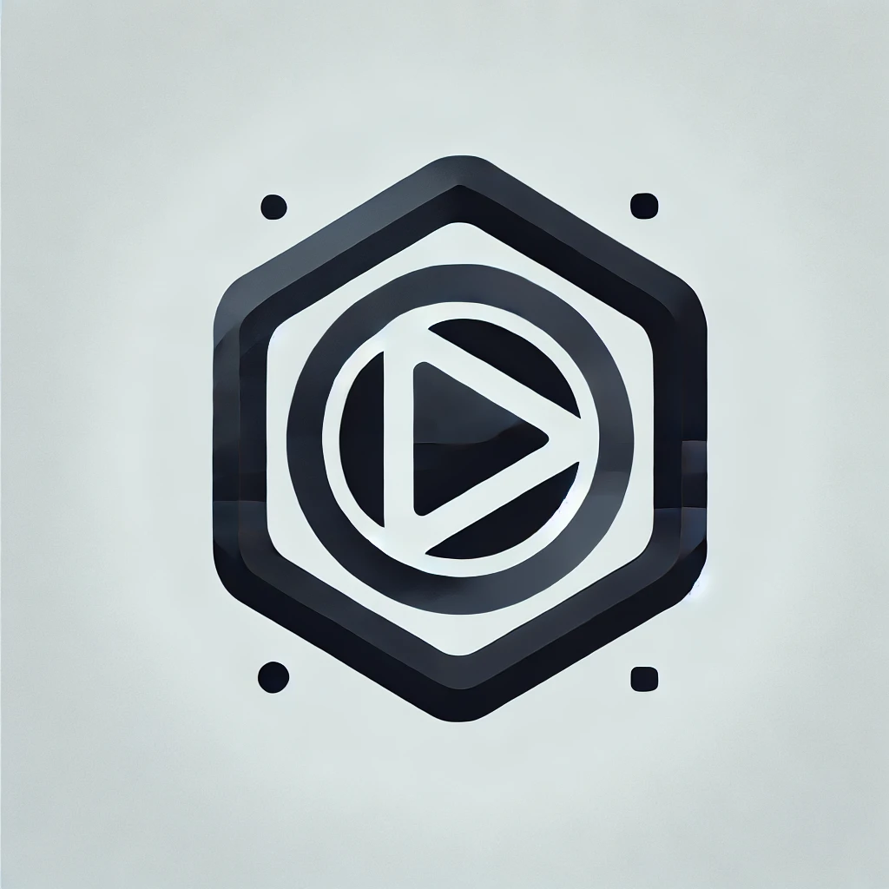

# 🎬 VideoForge - Automacao de Criacao de Videos No Faceless

<p align="center">
  
</p>
  

> Uma ferramenta poderosa para automatizar a criacao de videos No Faceless, otimizando todo o fluxo de producao para criadores de conteudo digital.

## 🚀 Sobre o VideoForge

**VideoForge** e uma solucao completa para gerenciar canais, agendar postagens e criar videos de forma automatica. O sistema combina geracao de roteiros, sintese de voz, selecao de midia e edicao automatizada para facilitar a producao de conteudo em massa.

## ✨ Recursos Principais
- 📆 **Agenda inteligente** para gerenciar datas de postagem.
- 📺 **Gestao de canais** para organizacao dos projetos.
- 🎙️ **Geracao de audio** com Piper.
- 🎞️ **Edicao de videos** e selecao de midias otimizada.
- 🤖 **Modo AutoForge**: fluxo automatizado de producao de video.
- 💾 **Banco de dados robusto** para armazenamento eficiente.
- 🛠️ **Ferramentas modulares** para uso independente.

## 🔨 Em Desenvolvimento
- 🔄 **Treinamento de modelo de voz proprio**.
- 🖼️ **Gerador de capas automatico**.
- 🕹️ **Dashboard interativo** com estatisticas.
- 📡 **Integracoes com plataformas de video** (YouTube, TikTok, etc.).

## 🐳 Como Rodar com Docker
Para ativar o Docker e rodar o VideoForge localmente, siga os passos:
1. Certifique-se de ter o **Docker** e **Docker Compose** instalados.
2. No terminal, navegue até a pasta do projeto e execute:
   ```sh
   docker-compose up --build
   ```
3. Acesse no navegador: [http://localhost:8080](http://localhost:8080)

Isso iniciará o servidor web do VideoForge dentro de um container Docker.

## 📌 Como Contribuir
Atualmente, o reposito rio e privado. No futuro, estarei expandindo funcionalidades e refinando o sistema. Sugestoes sao bem-vindas! 🚀

## 📷 Exemplo Visual
Coloque aqui imagens ou GIFs demonstrando o funcionamento do VideoForge assim que possivel.

## 🔗 Contato
📩 Para mais informacoes, entre em contato comigo!
Jacson11anderson.jsn@gmail.com

---

⚡ *Este README sera atualizado conforme o projeto evolui.*

